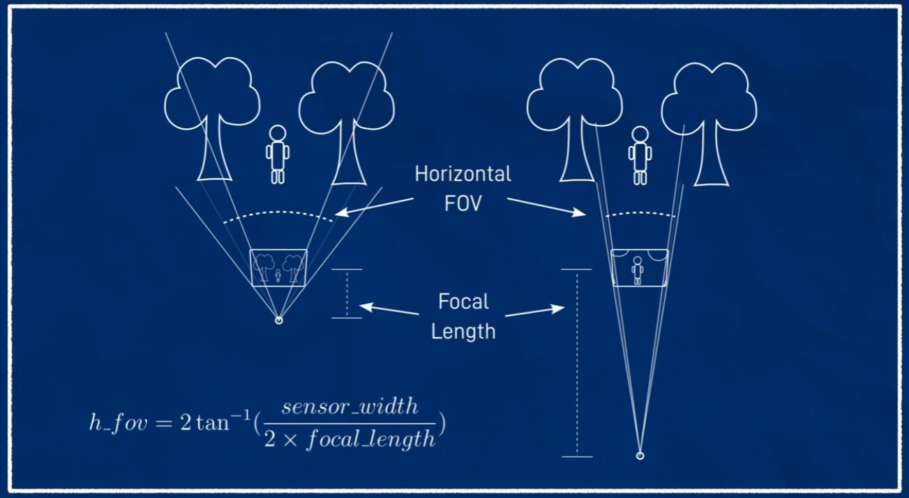
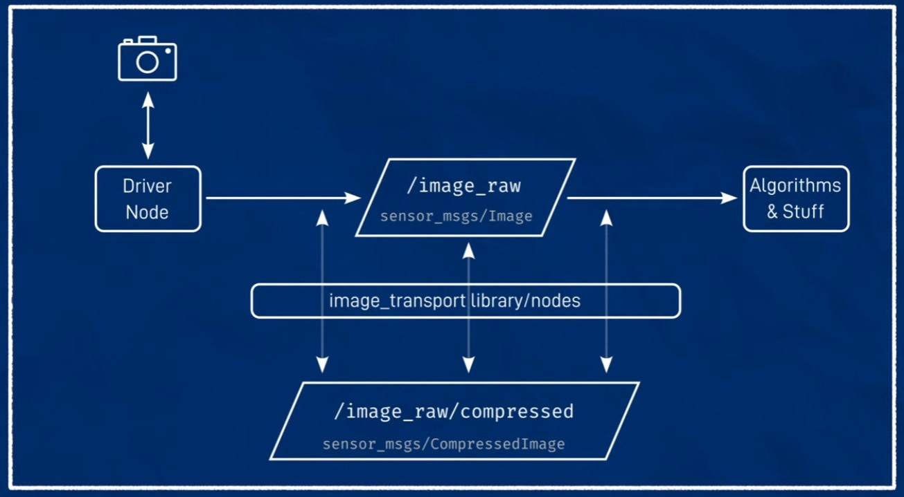
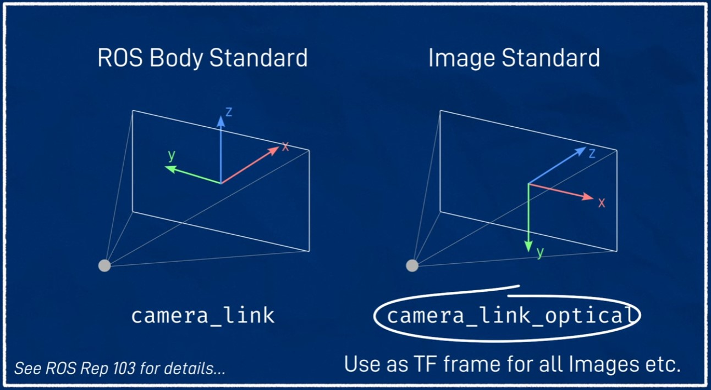

# 为你的小车添加摄像头

## 摄像头相关知识

RGB是一种加色模型，通过组合不同强度的红、绿、蓝光，能够产生广泛的颜色。这个模型通常用于电子显示设备，如电视、电脑显示器、手机屏幕等，因为它们通过发光二极管（LED）或液晶来显示颜色。

在RGB模型中，颜色通常表示为三个分量，分别是R（红）、G（绿）、B（蓝）。每个分量的值范围通常在0到255之间，在8位颜色深度下，总共可以组合出16,777,216种颜色（256×256×256）（图片来自[JoshNewans的视频](https://www.youtube.com/watch?v=A3nw2M47K50&list=PLunhqkrRNRhYAffV8JDiFOatQXuU-NnxT&index=9)）：

摄像头的视角（Field of View, FOV）和焦距（Focal Length）之间有密切的关系，它们共同影响摄像头能够捕捉到的场景范围和图像的放大程度。

焦距是镜头光学中心到图像传感器平面的距离，通常以毫米（mm）为单位表示。焦距决定了镜头的视角和放大倍率；而视角是指摄像头能够覆盖的场景范围，通常以度（°）表示。视角的大小直接受到焦距的影响。

视角和焦距之间的关系是反比的，即焦距越长，视角越窄；焦距越短，视角越宽。它们的具体关系可以通过以下图片反映（图片来自[JoshNewans的视频](https://www.youtube.com/watch?v=A3nw2M47K50&list=PLunhqkrRNRhYAffV8JDiFOatQXuU-NnxT&index=9)）：

ROS2提供了摄像头驱动节点（Driver Node），用来设置摄像头的一些参数，并且将来自摄像头的图片发布到`/image_raw`的topic当中，以便于后续在算法中订阅使用。

此外，ROS2还提供了一些图像压缩节点，可以用来将原始图像进行压缩（如转换为jpeg、png格式）来更好地兼容硬件：（图片来自[JoshNewans的视频](https://www.youtube.com/watch?v=A3nw2M47K50&list=PLunhqkrRNRhYAffV8JDiFOatQXuU-NnxT&index=9)）：

值得注意的是，同一个摄像头针对ROS2标准以及针对图像标准时，所采用的坐标系定义是不一样的。好在两种坐标系的Transform在ROS2中都有提供（图片来自[JoshNewans的视频](https://www.youtube.com/watch?v=A3nw2M47K50&list=PLunhqkrRNRhYAffV8JDiFOatQXuU-NnxT&index=9)）：

## 