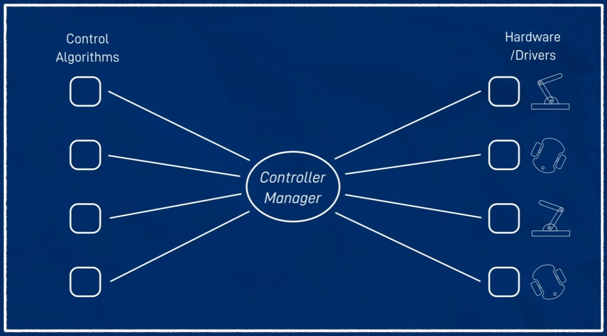
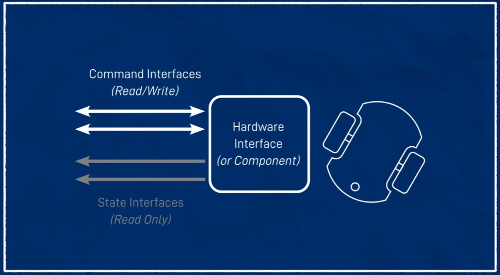
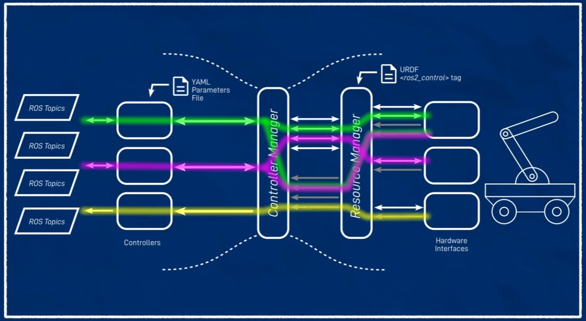
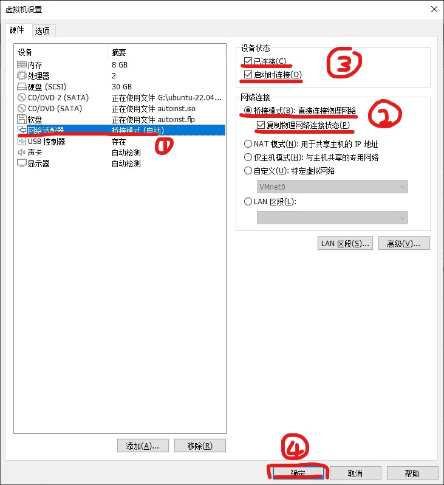

# 使用ROS2 Control来控制你的小车

## 什么是ROS2 Control？

**ROS2 Control** 是一个基于 ROS 2 的框架，主要用于机器人系统的硬件抽象、硬件接口管理以及控制器管理。它提供了一种标准化的方式来与机器人硬件进行交互，并管理各种控制器，从而简化了复杂机器人系统的开发和部署（图片来自[JoshNewans的视频](https://www.youtube.com/watch?v=4QKsDf1c4hc&list=PLunhqkrRNRhYAffV8JDiFOatQXuU-NnxT&index=12)）：



ROS2 Control具有以下功能：

- **硬件抽象**：ROS2 Control 提供了一种统一的硬件抽象层，使得不同类型的机器人硬件（如关节、传感器、执行器等）可以通过标准化的接口进行管理和控制。开发者不需要关心底层硬件的细节，只需与这些抽象接口进行交互。

- **硬件接口管理**：通过硬件接口，ROS2 Control 可以管理机器人的各种硬件资源。这些接口可以是模拟的或是实际的物理接口，用于与传感器或执行器等设备通信。

- **控制器管理**：ROS2 Control 支持加载和管理各种控制器（如位置控制器、速度控制器、力矩控制器等），并通过这些控制器来控制机器人的运动或行为。控制器可以动态加载、卸载和切换，增强了系统的灵活性。

## 为什么要使用它？

- **标准化和可重用性**：ROS2 Control 提供了标准化的接口，使得机器人开发者可以轻松复用代码，减少重复劳动。同时，也便于在不同机器人平台之间移植和扩展。

- **模块化设计**：ROS2 Control 的模块化设计允许开发者根据需求选择和定制不同的控制器和硬件接口，增强了系统的灵活性。

- **实时控制**：ROS2 Control 支持实时性要求较高的应用场景，能够满足一些工业机器人、无人机等需要精确控制的系统需求。

## 硬件接口

ROS2 Control为我们提供了抽象硬件接口，分为可以读写的指令接口以及只读的状态接口（图片来自[JoshNewans的视频](https://www.youtube.com/watch?v=4QKsDf1c4hc&list=PLunhqkrRNRhYAffV8JDiFOatQXuU-NnxT&index=12)）：



以我们的小车为例，其中小车两个驱动轮的速度是我们可以控制的，因此属于指令接口；而轮子的位置是我们无法直接控制，但是可以通过里程计得到的，因此属于状态接口。

在实际应用当中，我们往往会面临更多更复杂的硬件接口，为了方便与控制器接口进行交互，ROS2 Control通过资源管理器（Resource Manager）来整合所有的硬件接口。只需在机器人的urdf文件中加入`<ros2_control>`标签，你的硬件接口就可以被资源管理器识别并整合（图片来自[JoshNewans的视频](https://www.youtube.com/watch?v=4QKsDf1c4hc&list=PLunhqkrRNRhYAffV8JDiFOatQXuU-NnxT&index=12)）：


## 控制器接口

通常，控制器输入可以直接来自人为操作（例如，遥控）或系统的其他部分（例如，导航路径规划器）。我们一般使用`YAML`格式文件来规定控制器的参数。

在ROS2 Control中，我们使用控制器管理器（Controller Manager）来：
- 加载YAML文件所描述的控制器，
- 获取硬件资源管理器中提供的接口信息，
- 与特定的控制器进行交互，
- 给出最终所需的控制指令。

（图片来自[JoshNewans的视频](https://www.youtube.com/watch?v=4QKsDf1c4hc&list=PLunhqkrRNRhYAffV8JDiFOatQXuU-NnxT&index=12)）：



值得注意的是，我们所规定的控制器不一定要产生控制指令（上图中的黄色线）：例如，我们可以通过一个控制器来接收一个硬件的状态接口（如一个电机）所反馈的状态量（如电机的电流），并将其发布到一个ROS Topic当中。

最后，我们通常有以下几种方式来与控制器管理器交互：

- **通过 ROS 服务(适合简单的自动化控制)**：ROS 服务提供了一种标准化的方式来请求和接收控制器管理器的响应。通过调用特定的服务，用户可以启动、停止或切换控制器。这种方式适用于需要直接和明确控制某个控制器的场景。例如，可以使用服务来加载一个新的控制器，或是切换当前的控制模式。典型的服务包括 `/controller_manager/load_controller`、`/controller_manager/switch_controller`等。

- **通过 ros2 control CLI 工具(更适合调试和手动控制)**：ROS2提供了命令行接口（CLI）工具，这使得用户能够直接从终端与控制器管理器交互。使用CLI工具，用户可以执行与ROS服务相似的操作，如加载、启动和停止控制器，但不需要编写额外的代码。命令例如 `ros2 control load_controller` 或 `ros2 control switch_controller`。

- **通过专用节点/脚本(提供最大的灵活性，适合复杂的应用场景)**：用户可以编写专门的ROS节点或脚本来与控制器管理器进行交互。这些节点或脚本可以封装复杂的逻辑，例如动态加载和切换多个控制器，或是根据特定的系统状态来调整控制器的行为。这种方式通常用于更复杂的应用场景，其中简单的服务调用或CLI工具不足以满足需求。

## 在URDF文件中添加ROS2 Control插件

首先，在terminal中安装一些我们需要的包：

`sudo apt install ros-(ROS2版本)-ros2-control ros-(ROS2版本)-ros2-controllers ros-(ROS2版本)-gazebo-ros2-control`

接下来，我们在`~/(工作空间名字)/src/(package名字)/description`路径下新建一个`ros2_control.xacro`文件，用于添加ROS2控制插件。在新建完成后，不要忘记重新编译项目：

```
cd ~/(工作空间名字)
colcon build --symlink-install
```

同时，在`robot.urdf.xacro`文件当中，我们注释掉（`Ctrl+/`）对于`<gazebo_control.xacro>`的引用，并引用我们新建的xacro文件：

`<xacro:include filename="ros2_control.xacro"/>`

接下来，我们就可以开始添加ros2_control标签了（[完整代码](https://github.com/NUSShao/mobile_bot/blob/main/description/ros2_control.xacro)）：

```
    <ros2_control name="GazeboSystem" type="system">
        <!-- hardware type to be a gazebo system -->
        <hardware>
            <plugin>gazebo_ros2_control/GazeboSystem</plugin>
        </hardware>

        <joint name="base_left_wheel_joint">
            <!-- command interfaces -->
            <command_interface name="velocity">
                <param name="min">-10</param>
                <param name="max">10</param>
            </command_interface>
            <!-- state interfaces -->
            <state_interface name="velocity" />
            <state_interface name="position" />
            
        </joint>

        <joint name="base_right_wheel_joint">
            <!-- command interfaces -->
            <command_interface name="velocity">
                <param name="min">-10</param>
                <param name="max">10</param>
            </command_interface>
            <!-- state interfaces -->
            <state_interface name="velocity" />
            <state_interface name="position" />
            
        </joint>

    </ros2_control>
```

这里的ros2 control标签将ROS2中的硬件接口提供给控制器管理器。

在编写Gazebo插件之前，我们需要编写一个用于定义控制器的YAML文件（`my_controllers.yaml`）：

我们在`~/(工作空间名字)/src/(package名字)/config`路径下新建一个`my_controllers.yaml`文件，用于编写定义控制器的YAML文件。在新建完成后，不要忘记重新编译项目：

```
cd ~/(工作空间名字)
colcon build --symlink-install
```

接下来，我们来编写YAML文件（[完整代码](https://github.com/NUSShao/mobile_bot/blob/main/config/my_controllers.yaml)）：

```
controller_manager:
  ros__parameters:
    update_rate: 30
    use_sim_time: true

    diff_controller:
      type: diff_drive_controller/DiffDriveController

    joint_broadcaster:
      type: joint_state_broadcaster/JointStateBroadcaster

diff_controller:
  ros__parameters:
    # Set to a higher rate than the update rate to ensure we can catch each loop
    publish_rate: 50.0

    base_frame_id: base_link

    left_wheel_names: ['left_wheel_joint']
    right_wheel_names: ['right_wheel_joint']
    wheel_separation: 0.35
    wheel_radius: 0.05

    use_stamped_vel: false
```

接下来，我们编写Gazebo插件，用于在Gazebo中使用ros2 control（[完整代码](https://github.com/NUSShao/mobile_bot/blob/main/description/ros2_control.xacro)）：

```
    <gazebo>
        <plugin name="diff_drive" filename="libgazebo.ros_diff_drive.so">
            <parameters>$(find （package名字）)/config/my_controllers.yaml</parameters>
        </plugin>
    </gazebo>
```

随后，我们运行launch文件，可以看到[gazebo_ros2_control]相关的启动信息。我们在另一个terminal中输入：

`ros2 control list_hardware_interfaces`

可以看到，现在我们的指令接口和状态接口都可以被正确加载了：


接下来，我们在terminal中激活我们定义的控制器：

```
ros2 run controller_manager spawner diff_controller
ros2 run controller_manager spawner joint_broadcaster
```

此时，我们如果再次运行遥控器，就必须要把`cmd_vel`重新映射到`diff_controller/cmd_vel_unstamped`这个topic上才可以正常遥控小车：

`ros2 run teleop_twist_keyboard teleop_twist_keyboard --ros-args -r cmd_vel:=/diff_controller/cmd_vel_unstamped`

接下来，我们在`rsp_sim.launch.py`文件当中添加两个控制器的spawner：

```
    diff_drive_spawner = Node(
        package="controller_manager",
        executable="spawner",
        arguments=["diff_controller"],
    )

    joint_broad_spawner = Node(
        package="controller_manager",
        executable="spawner",
        arguments=["joint_broadcaster"],
    )
```

然后，在`LaunchDescription`中添加`diff_drive_spawner`和`joint_broad_spawner`，这样就可以在运行launch文件的同时，激活控制器了。

## 用移动设备（手机、平板）控制Gazebo中的机器人

**事先声明，为了实现这一功能，你的移动设备必须和电脑连接同一网络（最简单的就是像我一样开手机热点）。**

为了后续操作方便，这里先介绍虚拟机的网络设置操作（桥接模式才可以用远程设备发布消息到虚拟机上）。

首先，在虚拟机界面按下`Ctrl+Alt`以切回windows系统，再按下`Ctrl+D`唤出虚拟机设置界面；



然后按照上图，将虚拟机网络适配器中的连接模式改为**桥接模式**，保存退出，并重启虚拟机。

重启后，我们打开一个按下`Ctrl+Alt+T`打开一个terminal，输入`ifconfig`来查看ip地址：


这时，我们就得到了自己的虚拟机ip地址。

接下来，我们在project根目录下新建一个`html`子文件夹，新建一个[html服务器文件](https://github.com/NUSShao/mobile_bot/blob/main/html/index.html)，用来生成一些控制按钮，这些按钮绑定各自的事件，通过触发事件来向虚拟机中的ROS topic发布Twist消息，进而驱动小车。

安装`rosbridge_server`，并且运行websocket的launch文件：

```
sudo apt install ros-(ROS版本)-rosbridge-server
ros2 launch rosbridge_server rosbridge_websocket_launch.xml
```

此命令会启动一个WebSocke 服务器，默认监听在端口`9090`。

随后，在虚拟机端查看ip，在terminal中输入：

`ifconfig`

然后在虚拟机端启动一个http服务器：

```
cd ~/(工作空间名字)/src/（project名字）/html
python3 -m http.server 8000
```

随后，我们先在虚拟机中访问`(虚拟机ip):8000`，试验一下效果：


然后，在移动端设备浏览器中访问`(虚拟机ip):8000`，就可以实现远程控制了：


