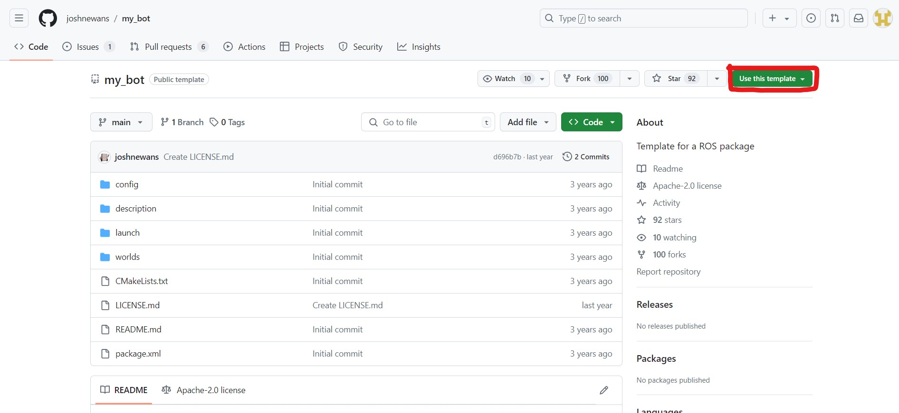
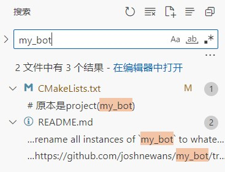
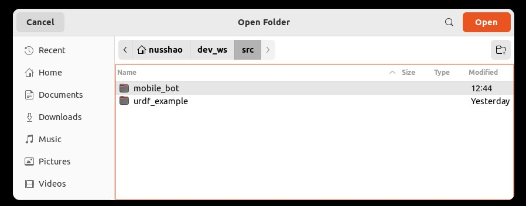
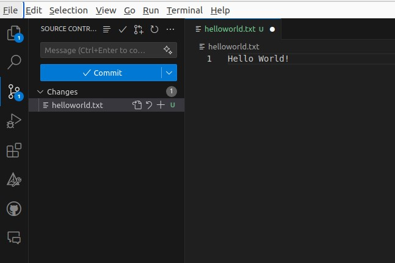
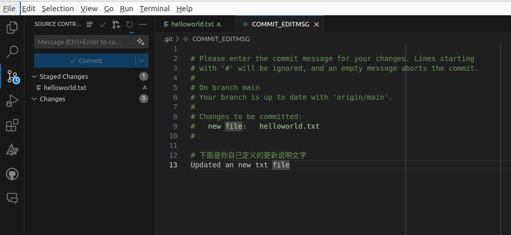

## 创建自己的项目仓库

现在，你可以通过访问'https://github.com/joshnewans/my_bot/tree/main'
点击右上角的“Use this template”绿色按钮来在自己的github repository中创建一个ROS Package。

随后，我们需要将模板中的项目名字，改为我们自己的项目名字：

单击键盘上的'.'键，打开github自带的网页编辑器，再按下'Ctrl+Shift+F'，搜索'my_bot'，将其改为自己的项目名字（我这里是叫做mobile_bot）

## 克隆项目仓库到本地

创建好项目仓库之后，我们要创建一个自己的ROS工作空间。这里不赘述如何创建。

随后，进入到工作空间的src子文件夹，在Terminal中克隆项目仓库到本地：

`git clone ${你自己的项目仓库URL}`

打开VSCode，进入到我们刚刚克隆好的项目仓库当中。

接下来，为了同步本地更新到GitHub上，我们需要下载GitHub Pull插件：

随后，在下方的Terminal中更新自己的用户名和邮箱：

现在，我们就可以将本地的变更同步到Github上面了。

我们随便创建一个文件，试一下效果：

接下来，在左侧的更新Tab中，选择Commit你的变更，并且在弹出的文件中，输入你的更新说明文字，点击右上角的√，进行Commit：

回到GitHub网页端，这时发现我们新创建的文件已经上传到项目仓库中了：

## 构建自己的项目

在项目代码编写完成之后，需要对Package进行构建（build）：

首先，按下'Ctrl+Alt+T'打开一个终端；随后，利用'cd'指令进入到workspace一级当中，并输入：

`colcon build`

在构建完成后，需要source一下我们的Package：

`source ~/dev_ws(这里改为你自己的workspace名字)/install/setup.bash`

为了避免重复进行source操作的麻烦，我们在终端中输入：

`gedit ~/.bashrc`

随后，将上述source的一行代码复制粘贴到.bashrc文件的末尾。这样，在我们每次打开一个Terminal的时候，系统自动运行source指令，无需我们再次重复操作。