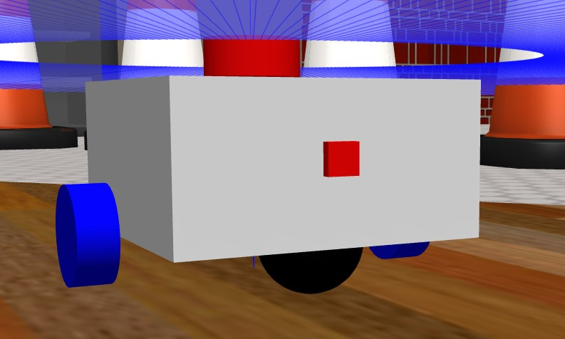
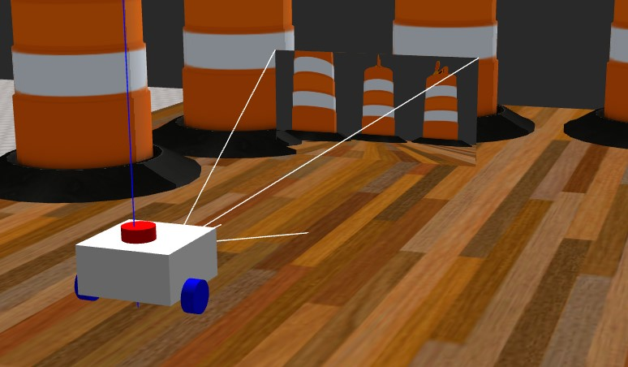

# 为你的小车添加摄像头

## 摄像头相关知识

RGB是一种加色模型，通过组合不同强度的红、绿、蓝光，能够产生广泛的颜色。这个模型通常用于电子显示设备，如电视、电脑显示器、手机屏幕等，因为它们通过发光二极管（LED）或液晶来显示颜色。

在RGB模型中，颜色通常表示为三个分量，分别是R（红）、G（绿）、B（蓝）。每个分量的值范围通常在0到255之间，在8位颜色深度下，总共可以组合出16,777,216种颜色（256×256×256）（图片来自[JoshNewans的视频](https://www.youtube.com/watch?v=A3nw2M47K50&list=PLunhqkrRNRhYAffV8JDiFOatQXuU-NnxT&index=9)）：


摄像头的视角（Field of View, FOV）和焦距（Focal Length）之间有密切的关系，它们共同影响摄像头能够捕捉到的场景范围和图像的放大程度。

焦距是镜头光学中心到图像传感器平面的距离，通常以毫米（mm）为单位表示。焦距决定了镜头的视角和放大倍率；而视角是指摄像头能够覆盖的场景范围，通常以度（°）表示。视角的大小直接受到焦距的影响。

视角和焦距之间的关系是反比的，即焦距越长，视角越窄；焦距越短，视角越宽。它们的具体关系可以通过以下图片反映（图片来自[JoshNewans的视频](https://www.youtube.com/watch?v=A3nw2M47K50&list=PLunhqkrRNRhYAffV8JDiFOatQXuU-NnxT&index=9)）：


ROS2提供了摄像头驱动节点（Driver Node），用来设置摄像头的一些参数，并且将来自摄像头的图片发布到`/image_raw`的topic当中，以便于后续在算法中订阅使用。

此外，ROS2还提供了一些图像压缩节点，可以用来将原始图像进行压缩（如转换为jpeg、png格式）来更好地兼容硬件：（图片来自[JoshNewans的视频](https://www.youtube.com/watch?v=A3nw2M47K50&list=PLunhqkrRNRhYAffV8JDiFOatQXuU-NnxT&index=9)）：


值得注意的是，同一个摄像头针对ROS2标准以及针对图像标准时，所采用的坐标系定义是不一样的。好在两种坐标系的Transform在ROS2中都有提供（图片来自[JoshNewans的视频](https://www.youtube.com/watch?v=A3nw2M47K50&list=PLunhqkrRNRhYAffV8JDiFOatQXuU-NnxT&index=9)）：


## 在Gazebo仿真环境中为小车添加摄像头

### 添加摄像头插件

为了在Gazebo中添加雷达，我们在`~/(工作空间名字)/src/(package名字)/description`路径下新建一个`camera.xacro`文件，用于添加雷达插件。在新建完成后，不要忘记重新编译项目：

```
cd ~/(工作空间名字)
colcon build --symlink-install
```

同时，在`robot.urdf.xacro`文件当中引用我们新建的xacro文件：

`<xacro:include filename="camera.xacro"/>`

接下来，我们就可以开始添加camera了（[完整代码](https://github.com/BIT-Gs/mobile_bot/blob/main/description/camera.xacro)）：

```
    <joint name="chassis_camera_joint" type="fixed">

        <parent link="chassis_link" />
        <child link="camera_link" />
        <origin xyz="0.305 0 0.08" rpy="0 0 0" />

    </joint>

    <link name="camera_link">

        <visual>
            <geometry>
                <box size="0.01 0.03 0.03" />
            </geometry>
            <material name="red" />
        </visual>

    </link>
```

同时，设置一个与camera_joint位置相同的关节，用于将ROS2标准的坐标系转换为摄像机图像标准坐标系：

```
    <joint name="chassis_camera_optical_joint" type="fixed">

        <parent link="camera_link" />
        <child link="camera_optical_link" />
        <origin xyz="0 0 0" rpy="${-pi/2} 0 ${-pi/2}" />

    </joint>

    <link name="camera_optical_link"></link>
```

完成之后，我们运行launch文件，就可以看到新建的摄像头link了：



接下来，我们进一步完善我们摄像头的gazebo标签：

```
        <!-- Sensor tag for camera -->
        <sensor name="camera" type="camera">

            <pose> 0 0 0 0 0 0 </pose>
            <visualize>true</visualize>
            <update_rate>10</update_rate>
            <!-- camera params -->
            <camera>
                <!-- Field of Vision -->
                <horizontal_fov>1.089</horizontal_fov>
                <!-- image params -->
                <image>
                    <format>R8G8B8</format>
                    <width>640</width>
                    <height>480</height>
                </image>
                <!-- image clip -->
                <clip>
                    <near>0.05</near>
                    <far>8.0</far>
                </clip>

            </camera>
            <!-- gazebo camera control plugin -->
            <plugin name="camera_controller" filename="libgazebo_ros_camera.so">
                <frame_name>camera_link_optical</frame_name>
            </plugin>
```

完成后，我们保存，将`lidar.xcaro`中的`visual`标签设置为`false`（你可以按下`Ctrl+F`来搜索'visual'）。随后，再次运行launch文件，可以看到摄像头的信息：



然后，我们在terminal中再次打开遥控节点，看下图像能否随着小车位置更新：


