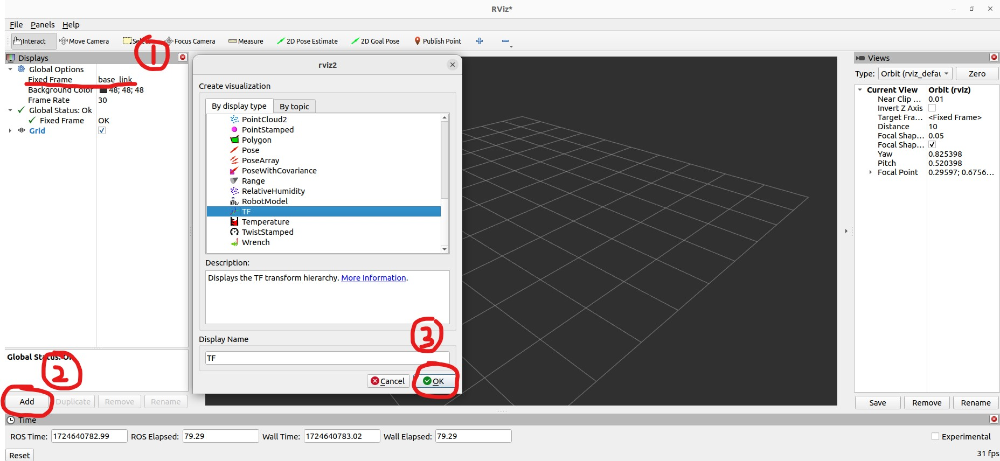
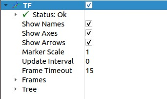
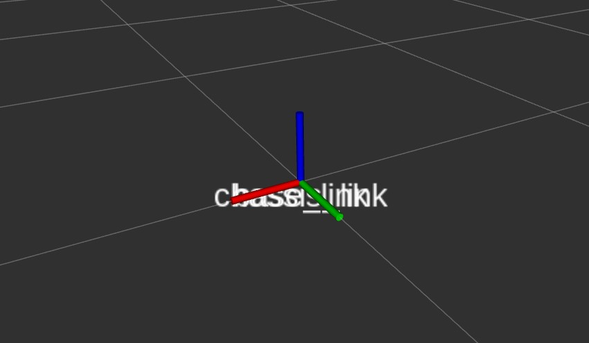
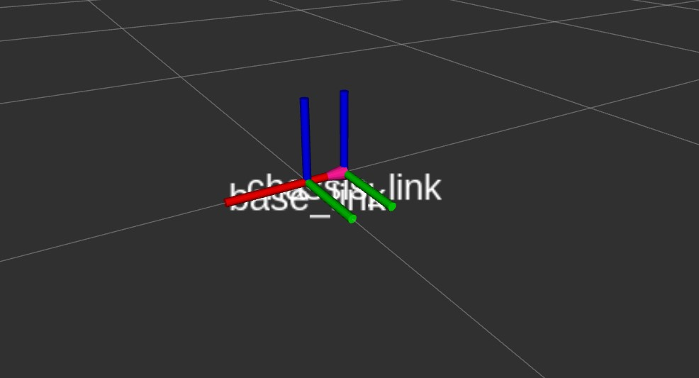
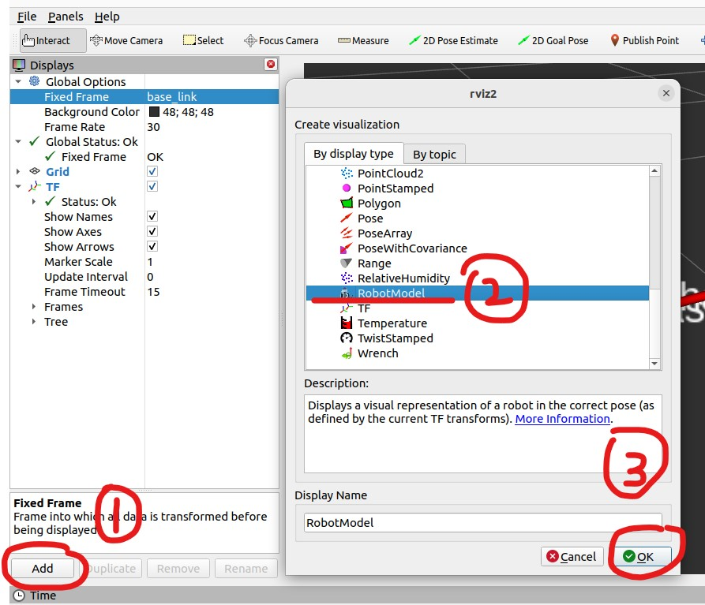
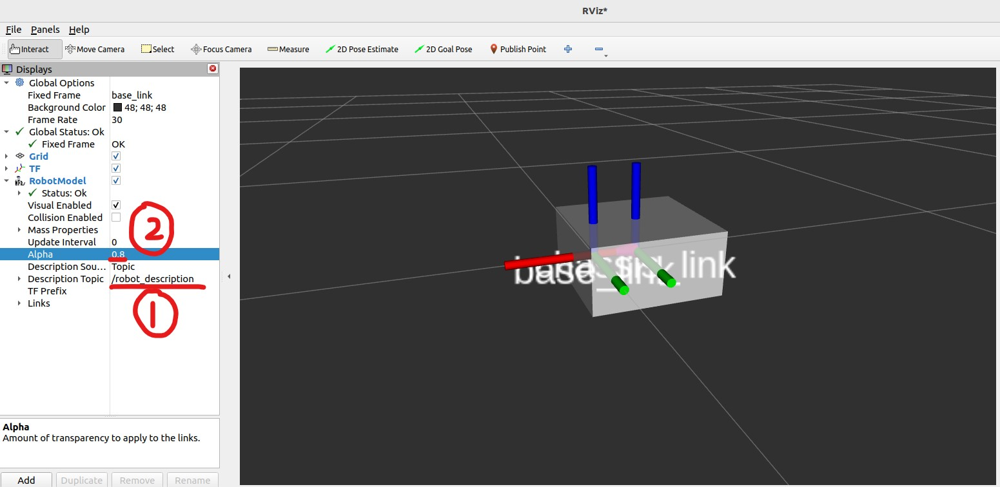
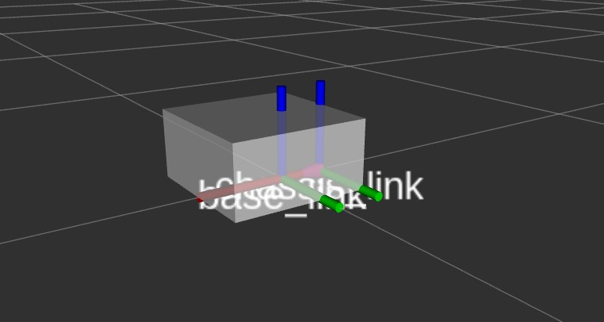
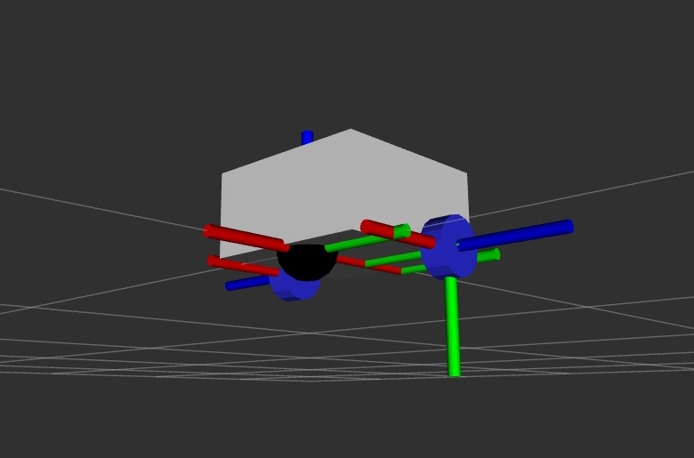

# 为你的机器人建模

## 文件格式

URDF（Unified Robot Description Format）和Xacro（XML Macro）文件在ROS项目中起着至关重要的作用，主要用于描述和配置机器人的模型。

## URDF文件

URDF 是一种基于 XML 的文件格式，专门用于定义机器人的物理模型。它详细描述了机器人的各个组成部分，包括关节、连杆、形状、惯性、碰撞检测和视觉元素。URDF 文件的主要作用如下：

**1.定义机器人结构**:URDF 用于描述机器人的连杆（links）和关节（joints）的几何结构、质量属性、碰撞模型和可视化模型。通过这种描述，ROS 系统能够理解机器人的形状和动态特性。

**2.支持仿真与可视化**:URDF 文件通常用于工具如 Gazebo（用于物理仿真）和 RViz（用于机器人状态的可视化）中，让开发者能够仿真和可视化机器人在虚拟环境中的行为。

**3.机器人状态推断**：通过 URDF 文件，ROS 可以推断机器人在不同时间的状态信息，如关节位置和姿态，从而为控制和感知模块提供数据。

## XACRO文件

Xacro 是一种基于 XML 的宏扩展格式，用于生成更简洁和模块化的 URDF 文件。Xacro 文件的主要功能包括：

**1.简化代码复用**：Xacro 允许使用宏、变量和参数，使得可以重用代码片段。例如，如果多个地方使用相同的组件，可以用 Xacro 编写一次宏，然后在需要的地方调用，从而减少重复代码。

**2.提高灵活性**：Xacro 文件通过参数化的方式定义机器人模型，可以根据不同的参数值自动生成适应不同配置的 URDF 文件。这在需要生成多个不同配置的机器人模型时非常有用。

**3.更好的管理复杂模型**：Xacro 使得管理大型和复杂的机器人模型更加容易。通过分解代码并使用宏和参数，可以更有效地组织模型的不同部分。

## 编写机器人外观框架XACRO文件

首先，Josh Newans提供的模板当中的description文件夹下，有一个robot.urdf.xacro范例文件。
```
<?xml version="1.0"?>
<robot xmlns:xacro="http://www.ros.org/wiki/xacro"  name="robot">

    <!-- Example link -->
    <link name="base_link"></link>

</robot>
```

我们将最后在这个文件中进行机器人模型的整合。

因此，我们首先新建一个robot_core.xacro文件，用于表示机器人外观框架。开始编写之前，先在robot.urdf.xacro文件中引用我们新建的xacro文件：

`<xacro:include filename="robot_core.xacro"/>`

随后，我们为新建的xacro文件套用模板(注意，这里的robot标签中删掉了name属性，因为这个文件只作为引用文件)：

```
<?xml version="1.0"?>
<robot xmlns:xacro="http://www.ros.org/wiki/xacro">

    <link name="base_link"></link>

</robot>
```

在开始编写文件之前，推荐大家从左侧Extension栏中安装XML插件，然后从右下角的文件类型处，将格式选择为XML格式：


接下来正式开始编写机器人主体框架。

### material标签

首先，创造一些material标签，用来为模型的各个link上色：

```
<?xml version="1.0"?>
<robot xmlns:xacro="http://www.ros.org/wiki/xacro">

    <material name="white">
        <color rgba="1 1 1 1" />
    </material>

    <material name="orange">
        <color rgba="1 0.3 0.1 1" />
    </material>

    <material name="blue">
        <color rgba="0.2 0.2 1 1" />
    </material>

    <material name="black">
        <color rgba="0 0 0 1" />
    </material>

    <link name="base_link"></link>

</robot>
```

这里为了方便大家理解文件的构成，把整体代码放上去了。

后面为了简洁性，只展示新增的代码片段（[整体代码](https://github.com/NUSShao/mobile_bot/blob/main/description/robot_core.xacro)）

### 底盘（chassis link）

接下来，我们先不管base link，先把底盘（chassis）部分写好，我们需要首先利用一个fixed类型的joint来连接Chassis和base link，然后再编写Chassis link：

```
    <!-- joint between base and chassis -->
    <joint name="base_chassis_joint" type="fixed">
        <parent link="base_link" />
        <child link="chassis_link" />
        <origin xyz="0 0 0" />
    </joint>
    <!-- chassis link -->
    <link name="chassis_link">
        <visual>
            <geometry>
                <box size="0.3 0.3 0.15" />
            </geometry>
            <material name="white" />
            <origin xyz="0 0 0" />
        </visual>
    </link>
```

注意，这里joint与chassis link的origin都放在了(0,0,0)的位置。

接下来，我们将编译package，利用Rviz2来调整原点坐标。

首先，打开Terminal，输入以下指令：

```
cd ~/(你自己workspace的名字)
colcon build --symlink-install
```

这里，编译中的 **--symlink-install**选项可以对package中 **已有文件的变更执行自动编译**。因此，除非你在项目中新建了代码文件，否则你不需要再次进行编译。

接下来，我们将运行launch文件，运行ros2中的robot state publisher：

`ros2 launch (你自己project的名字) rsp.launch.py`

这样，ROS2就根据我们的URDF/XACRO文件开始发布机器人的状态信息。

接下来，我们启动Rviz2，在可视化的条件下调整坐标系的原点位置。另外启动一个Terminal，输入：

`Rviz2`

然后，根据以下顺序进行设置好TF(Transform)，就可以看到base link以及chassis link各自的坐标系：







现在，我们的坐标系出现了重叠。实际上，我们想要的效果是这样的（图片来源于JoshNewans大佬的视频）：


其中，base link的原点位于两个后轮的中间点；而chassis link的原点则位于底盘的后方中间点。

因此，我们将base_chassis_joint的origin位置调整为：

`<origin xyz="-0.1 0 0" />`

随后，我们打开运行launch文件的Terminal，按下Ctrl+C，然后按下↑，重新运行launch文件，来更新Rviz2中的视觉效果：



接下来，我们调整底盘的几何形状位置。首先，添加一个RobotModel：



然后，调整Description Topic为/robot_description，并设置α（透明度）为0.8：



可以看到，现在的Box是以chassis link坐标系的原点为中心，我们想要做出以下调整（图片来自[JoshNewans的视频](https://www.youtube.com/watch?v=BcjHyhV0kIs&list=PLunhqkrRNRhYAffV8JDiFOatQXuU-NnxT&index=3)）：


`<origin xyz="0.15 0 0.075" />`



现在，我们的底盘位置就如我们所愿了。

### 后轮（Wheel link）

有了之前底盘的经验，我们这里简短介绍。

首先，编辑左轮的joint origin：


```
    <!-- left wheel link -->

    <joint name="base_left_wheel_joint" type="continuous">
        <parent link="base_link" />
        <child link="left_wheel_link" />
        <origin xyz="0 0.175 0" rpy="-${pi/2} 0 0" />
        <axis xyz="0 0 1" />
    </joint> 
```

然后，编辑左轮的link：

```
    <link name="left_wheel_link">
        <visual>
            <geometry>
                <cylinder radius="0.05" length="0.04" />
            </geometry>
            <material name="blue" />
        </visual>
    </link>
```

右轮和左轮情况一样，对称一下即可：

```
    <!-- right wheel link -->

    <joint name="base_right_wheel_joint" type="continuous">
        <parent link="base_link" />
        <child link="left_right_link" />
        <origin xyz="0 -0.175 0" rpy="${pi/2} 0 0" />
        <axis xyz="0 0 -1" />
    </joint>

    <link name="right_wheel_link">
        <visual>
            <geometry>
                <cylinder radius="0.05" length="0.04" />
            </geometry>
            <material name="blue" />
        </visual>
    </link>
```

随后，我们重新launch状态发布器(Ctrl+C, ↑, Enter)，并且打开一个新的Terminal，运行joint_state_publisher_gui:

```
ros2 run joint_state_publisher_gui joint_state_publisher_gui 
```

打开Rviz2，我们现在可以通过状态发布器GUI（图形界面）来控制轮子转动了：


### 前轮（caster wheel）

接下来，我们简单地将前轮（脚轮，caster wheel）设置为一个无摩擦的球体（sphere）(我们会在后续设置其他属性，目前只考虑外形)：

```
    <!-- caster wheel link -->

    <joint name="chassis_caster_wheel_joint" type="fixed">
        <parent link="chassis_link" />
        <child link="caster_wheel_link" />
        <origin xyz="0.24 0 0" />
    </joint>

    <link name="caster_wheel_link">
        <visual>
            <geometry>
                <sphere radius="0.05" />
            </geometry>
            <material name="black" />
        </visual>
    </link>
```

同样，在按下Ctrl+S保存改动之后，我们在Terminal当中重新运行State Publisher launch文件，便可以在Rviz2中看到我们刚刚加的脚轮：



### 碰撞（Collision）属性以及惯性（inertial）属性

我们现在已经完成了小车机械结构组件的外观（visual）属性编辑。

接下来，我们要为每个link添加它们自己的碰撞（Collision）属性以及惯性（inertial）属性。

首先是碰撞属性，以chassis link为例：

```
    <collision>
        <geometry>
            <box size="0.3 0.3 0.15" />
        </geometry>
        <origin xyz="0.15 0 0.075" />
    </collision>
```

这里，我们对于碰撞属性的描述，和外观属性几乎一致（删去了material一行）。

对于其他link，我们如法炮制。全部完成后，我们重新launch状态发布器，在Rviz2中勾选"Collision Enabled"一栏，可以看到模型现在的碰撞体积（其实和视觉长得一样）：


随后，我们编辑惯性属性。

由于为每个link单独计算惯性矩阵（inertial matrix）是一件很麻烦的事情，所以我们需要单独编写一个用于计算惯性矩阵的xacro扩展文件。

所幸JoshNewans大神已经为我们写好了这个[惯性矩阵计算文件](https://github.com/joshnewans/articubot_one/blob/d5aa5e9bc9039073c0d8fd7fe426e170be79c087/description/inertial_macros.xacro)。

因此，我们只需在description文件夹下新建一个"inertial_macros.xacro"文件，并且将内容复制进去即可。

此外，不要忘记重新编译整个项目，因为我们新建了一个xacro文件：

```
cd ~/（你的workspace名字）
colcon build --symlink-install
```

现在，我们只需在robot_core.xacro文件的开头引用惯性矩阵计算文件，就可以很方便地为每一个link添加其inertial属性了：

`<xacro:include filename="inertial_macros.xacro" />`

这里还是以chassis link为例。

在inertial_macros.xacro文件中，JoshNewans大佬写好的惯量矩阵计算代码如下：

```
    <xacro:macro name="inertial_box" params="mass x y z *origin">
        <inertial>
            <xacro:insert_block name="origin"/>
            <mass value="${mass}" />
            <inertia ixx="${(1/12) * mass * (y*y+z*z)}" ixy="0.0" ixz="0.0"
                    iyy="${(1/12) * mass * (x*x+z*z)}" iyz="0.0"
                    izz="${(1/12) * mass * (x*x+y*y)}" />
        </inertial>
    </xacro:macro>
```

因此，我们可以在robot_core.xacro中，直接传入参数调用它：

```
    <xacro:inertial_box mass="0.5" x="0.3" y="0.3" z="0.15">
        <origin xyz="0.15 0 0.075" rpy="0 0 0" />
    </xacro:inertial_box>
```

在完成编辑所有link对应的inertial属性后，我们完成了模型描述文件的编辑。

随后，我们在Rviz2界面点击左上角File->Save Config As，并且将我们的config文件存储到以下路径，以便后续调用Rviz2查看模型：


现在，我们只需要在Terminal中运行以下代码，就可以在Rviz2中查看模型：

```
cd ~/(你的工作空间名字)/src/(你的project名字)
rviz2 -d config/view_bot.rviz
```